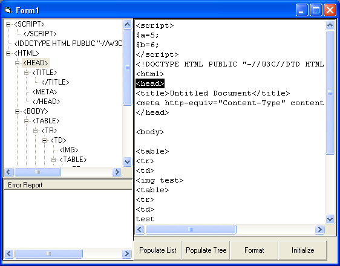



## Adam's HTML Tree Class

### Description

Ever wanted to make that Tag Inspector Tree like in Dreamweaver MX. Well here is my attempt at making one. This is a class that will take HTML code parse it up and build a data tree. Then you can use it to build a tree view or even do HTML source formatting. Let me know what you think.
 
### More Info
 

             |
---                |---
**Submitted On**   |2003-01-19 14:12:44
**By**             |[Adam Ruggles](https://github.com/Planet-Source-Code/PSCIndex/blob/master/ByAuthor/adam-ruggles.md)
**Level**          |Advanced
**User Rating**    |4.9 (39 globes from 8 users)
**Compatibility**  |VB 6\.0
**Category**       |[Data Structures](https://github.com/Planet-Source-Code/PSCIndex/blob/master/ByCategory/data-structures__1-33.md)
**World**          |[Visual Basic](https://github.com/Planet-Source-Code/PSCIndex/blob/master/ByWorld/visual-basic.md)
**Archive File**   |[Adam's\_HTM1531671192003\.zip](https://github.com/Planet-Source-Code/adam-ruggles-adam-s-html-tree-class__1-42570/archive/master.zip)

